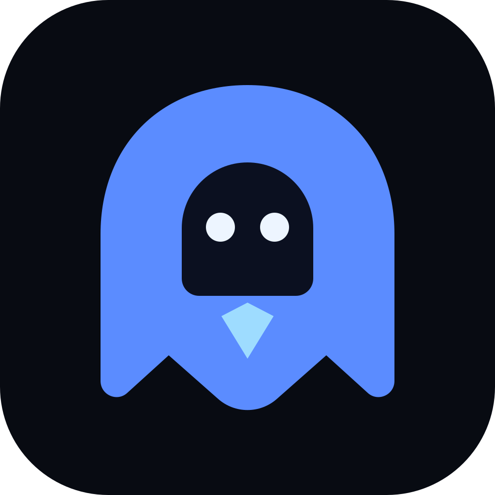

<p align="center">
  
</p>

<h1 align="center">GhostPilot</h1>

<p align="center">
  A local-first desktop copilot for meetings, interviews, and coding.
</p>

<p align="center">
  <a href="https://github.com/z12ob/GhostPilot/releases"></a>
  <a href="https://github.com/z12ob/GhostPilot/actions/workflows/ci.yml"></a>
  <a href="LICENSE"></a>
</p>

GhostPilot is an open-source Electron overlay that combines your screen, microphone, and meeting audio with an AI provider you choose. It can suggest a reply during a conversation, answer questions about the current screen, solve coding problems, and turn a long transcript into organized notes.

Bring your own API key for OpenAI, Anthropic, Google Gemini, Azure AI Foundry, Groq, MiniMax, or an OpenAI-compatible endpoint. Ollama is supported for local chat models.

## Highlights

- Separate microphone and meeting-audio channels for clearer speaker context
- Real-time Assist and What should I say actions
- Screen-aware questions and coding help
- Interview context from a resume, job description, and personal notes
- Long-session notes with a summary, cheat sheet, topics and connections, decisions, action items, open questions, and follow-up
- Local Whisper transcription option
- No GhostPilot account or telemetry

## Platform support

| Capability | Windows 10/11 x64 | Linux | macOS |
|---|---:|---:|---:|
| Prebuilt download | Yes | Yes | Not yet |
| Screen context | Yes | Yes | Yes |
| Microphone transcription | Yes | Yes | Yes |
| Meeting audio | Yes | Depends on desktop audio support | macOS 14.4 or later |
| Screen-share exclusion | Best effort | Varies | Best effort |

Screen-share exclusion depends on the operating system and capture application. It is not guaranteed. Use GhostPilot only when recording, transcription, and assistance are permitted by the people involved and by the applicable rules.

## Install

### Windows

1. Open [GitHub Releases](https://github.com/z12ob/GhostPilot/releases).
2. Download `GhostPilot-win-x64.zip` for the recommended portable build.
3. Extract the zip to its own folder, then run `GhostPilot.exe` from that folder.
4. If Windows SmartScreen appears, select **More info**, then **Run anyway**. Current builds are not code-signed.
5. Follow the setup guide, open Settings, choose a provider, and enter the required API key.
6. Join a call, make sure its sound plays through the current Windows default output device, then select **Listen**.

The optional `GhostPilot-win-x64.exe` is the standard Windows installer. It adds Start menu and desktop shortcuts. The portable zip is recommended while releases are unsigned.

### Linux

Download the AppImage that matches your CPU:

- `GhostPilot-1.1.0-linux-x86_64.AppImage`
- `GhostPilot-1.1.0-linux-arm64.AppImage`

For x64 Linux:

```bash
chmod +x GhostPilot-1.1.0-linux-x86_64.AppImage
./GhostPilot-1.1.0-linux-x86_64.AppImage
```

Desktop audio capture varies across Wayland, X11, PipeWire, and desktop environments.

### macOS

Signed macOS downloads are not published yet. To run GhostPilot from source, use Node.js 22.12 or later and follow the development setup below.

## Release files

| File | Intended user |
|---|---|
| `GhostPilot-win-x64.zip` | Recommended portable Windows app |
| `GhostPilot-win-x64.exe` | Optional Windows installer |
| `GhostPilot-1.1.0-linux-x86_64.AppImage` | Linux x64 app |
| `GhostPilot-1.1.0-linux-arm64.AppImage` | Linux arm64 app |
| Source code (zip) | Developers who want the tagged source snapshot |
| Source code (tar.gz) | Developers who prefer a tar archive |

GitHub automatically adds the two source archives to every release. The four GhostPilot files are the runnable builds produced by the release workflow.

## Use GhostPilot in a meeting

1. Set your operating system input and output devices before the call.
2. Open GhostPilot and select **Listen**.
3. Confirm that the transcript shows both **You** and **Them** when each side speaks.
4. Use **Assist**, **What should I say?**, or **Follow-up** when needed.
5. At the end, select **Recap** before quitting or clearing the transcript.

For long sessions, GhostPilot keeps recent audio buffers bounded while retaining a much larger text transcript. Recap processes long transcripts in sections, then organizes the combined result. GhostPilot does not save an audio recording or persist the live transcript after the app exits, so copy important notes before closing it.

Changing the Windows default output device during a call can end the loopback stream. Select **Stop**, set the correct device, then select **Listen** again.

## Use GhostPilot in an interview

1. Open Settings and add your resume, job description, and interview notes.
2. Test your microphone, meeting audio, provider, and shortcuts before the interview.
3. Select **Listen** after joining the call.
4. Use **What should I say?** for a suggested spoken answer or **Assist** for screen and conversation context.
5. Use **Follow-up** to prepare relevant questions and **Recap** to organize the discussion.

GhostPilot can help organize your own experience and thinking. Review every suggestion before using it, and follow the interviewer's rules.

## Controls

| Action | Windows | macOS |
|---|---|---|
| Assist | `Ctrl+Enter` | `Command+Enter` |
| Solve the coding problem on screen | `Ctrl+H` | `Command+H` |
| Open Settings | `Ctrl+,` | `Command+,` |
| Ask a typed question | Enter | Enter |

The panel also includes Listen, What should I say?, Follow-up, Recap, and a Smart model toggle.

## Configuration

Open Settings from the panel or with `Ctrl+,` on Windows.

| Provider | Configuration |
|---|---|
| OpenAI | API key and model names |
| Anthropic | API key and models; choose a separate transcription provider |
| Google Gemini | API key and models |
| Azure AI Foundry | API key, endpoint, and deployment names |
| Groq | API key and models |
| MiniMax | API key, region, and models |
| Custom | OpenAI-compatible base URL, models, and an API key when required |
| Ollama | Local Ollama URL and model |

For local transcription, select a Whisper model under Settings, then download it. Packaged apps include the whisper.cpp runtime. Source builds need `npm run prepare:whisper` once before local transcription is used.

## Troubleshooting

| Problem | What to check |
|---|---|
| Meeting audio does not appear under Them | Stop and start listening. Confirm the call plays through the Windows default output device. Disable exclusive mode for that device if another app has locked it. |
| Microphone does not appear under You | Open Windows **Settings > Privacy & security > Microphone** and enable both microphone access and desktop app access. GhostPilot may not appear as a separate Windows toggle. Restart it after changing access. |
| Only one side is transcribed | Speak on both sides and confirm the call is not using a different output device. Bluetooth profile changes can switch devices during a call. |
| The downloaded zip is very small | You downloaded GitHub's source archive. Download `GhostPilot-win-x64.zip` from the release assets instead. |
| SmartScreen blocks the app | Current builds are unsigned. Use **More info > Run anyway**, or inspect and build the source yourself. |
| Local transcription cannot start | Download the selected model in Settings. Source builds also need `npm run prepare:whisper`. |
| The provider reports a key or quota error | Confirm the active provider, API key, model name, billing, and quota in Settings. |

## Updating

GhostPilot does not update itself yet. Existing downloads remain on the version that was installed or extracted.

- Portable Windows build: close GhostPilot, download the new zip, extract it to a new folder, and run the new `GhostPilot.exe`.
- Windows installer: close GhostPilot, download the new installer, and install it over the existing version.
- Linux: download the new AppImage and replace the old file.

Settings, API keys, and downloaded local transcription models live in the operating system user-data folder, outside the application folder. Replacing the app should preserve them.

## Privacy and security

- GhostPilot has no account system or telemetry.
- Settings and API keys are stored locally in `ghostpilot-data.json` under Electron's user-data folder.
- Audio is processed in memory and is not saved as an audio file.
- Screenshots are captured only for screen-aware actions.
- Audio, screenshots, transcripts, and prompts may be sent to the providers you configure.
- Local Whisper keeps speech-to-text processing on the device, but chat requests still follow the selected chat provider.

Review the privacy and retention policies of every provider you configure. Do not capture confidential conversations without authorization.

## Architecture

GhostPilot keeps its renderer isolated from Node.js and exposes a limited IPC bridge through the preload script. The main process owns orchestration, screenshots, transcription, provider calls, and application state. The renderer owns the overlay and browser media capture.

Long-session safeguards include:

- Bounded PCM buffers for both audio channels
- A bounded text transcript that preserves far more than the previous 200-turn window
- Section-by-section recap generation for transcripts that exceed a single prompt
- Abortable provider requests and an inactivity timeout
- Batched token rendering to protect UI responsiveness
- Independent microphone and meeting-audio startup
- A current Electron runtime and a production dependency audit with no known vulnerabilities

Set `GHOSTPILOT_NO_PROTECT=1` only when debugging screen-share exclusion.

## Development

Requirements: Node.js 22.12 or later and npm.

```bash
git clone https://github.com/z12ob/GhostPilot.git
cd GhostPilot
npm ci
npm test
npm start
```

Prepare the local Whisper runtime when needed:

```bash
npm run prepare:whisper
npm run verify:whisper-runtime
```

Build packages:

```bash
npm run pack:win
npm run dist:win
npm run dist:linux
npm run dist:linux:arm64
```

Project history is recorded in [CHANGELOG.md](CHANGELOG.md).

## License

GhostPilot is available under the [MIT License](LICENSE). Copyright (c) 2026 Guram Melikidze.

Local transcription uses [whisper.cpp](https://github.com/ggml-org/whisper.cpp), which is also MIT licensed. Its license is included at `build-resources/whisper.cpp.LICENSE`.
